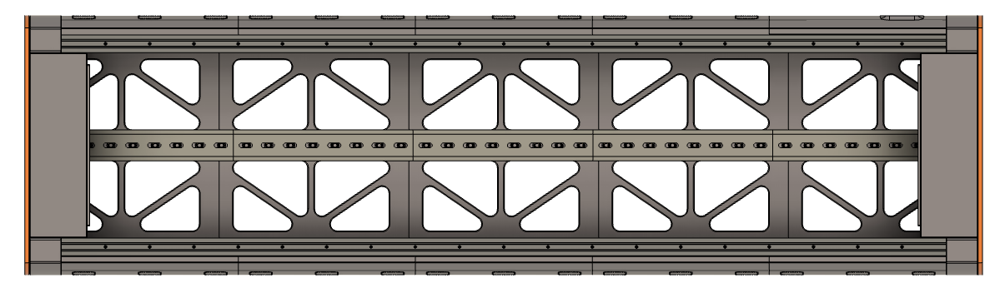
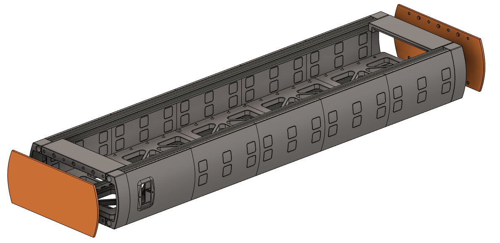

# EDM Test Rig

## Summary
This repository contains the documentation and resources for the EDM Test Rig, a test stand developed for advancing Electrical Discharge Machining (EDM) technology. The rig is designed to facilitate the development and testing of EDM components and systems. 

**Systems of EDM Test Rig**
| System                        | Description                                       | 
|-------------------------------|---------------------------------------------------| 
| DIN Rail Box                  | Mounts PSUs and control systems on DIN rails      | 
| Kinematics                    | Provides movement of EDM test items               | 

## EDM Test Rig Specifications
Specifications of EDM Test rig.
| Specification | Description                                       |
|---------------|---------------------------------------------------|
| Approximate Cost  | 2,000 USD                                     |
| Size              | 1.4 m x 0.58 m x 1.4 m                        | 
| Construction      | 40x40, 20x20 Extruded Aluminum                | 
| Kinematics        | C7-Class Ballscrews + NEMA23 Stepper Motors   |
| Linear Resolution | +- 30 Microns Maximum                         | 
| 3D Printer        | FDM, Bambu Labs X1C                           | 
| Power             | 120 VAC, 60 Hz                                |
| Firmware          | DangerKlipper                                 | 
| Operating System  | Linux                                         | 
| DIN Rail Space    | 40", 35 mm wide, 7.5 mm tall                  | 
| On-Board Power    | 48 VDC, 24 VDC, 12 VDC, 5 VDC                 |

## DIN Rail Box
The DIN rail box provides 40 inches of 35 mm x 7.5 mm DIN rail space for mounting power supply units (PSUs), control systems, and other equipment. This setup ensures organized and efficient management of components within the EDM Test Rig.

Note: The CAD models for the 2020 aluminum extrusions do not use T-slot nuts, but M4 taps. However, T-slot nuts are recommended.  

### DIN Rail Box Bill of Materials
Required FDM 3D prints for DIN rail box. This project requires several kilograms of filament. Print components with a brim to prevent warping. Enable ironing of top surfaces for base plates for a better surface quality. 
| 3D Prints                                     | Description                            | Quantity | Material      |
|-----------------------------------------------|----------------------------------------|----------|---------------|
| Base Plate                                    | Connects DIN rails to extrusions       | 5        | PLA or ASA    |
| Top Spacer                                    | Connects adjacent extrusions           | 2        | PLA or ASA    |
| End Brace                                     | Braces adjacent extrusions             | 4        | PLA or ASA    |
| PEM Cover                                     | Mounts PEM module to side              | 1        | PLA or ASA    |
| Side Cover                                    | Enclosure, with knockouts for wiring   | 9        | PLA or ASA    |
| End Cover                                     | Enclosure, magnetically retained       | 2        | PLA or ASA    |

Hardware for DIN rail box: DIN rails, 2020 Aluminum extrusions, & Fasteners. 
| Item                                          | Description                            | Quantity | Link | 
|-----------------------------------------------|----------------------------------------|----------|------|
| DIN Rails                                     | 35 mm x 7.5 mm, 8" long                | 5        | [Amazon](https://a.co/d/1iSyUIB)                      |
| 2020 Aluminum Extrusion                       | 1 Meter Length, M6 end taps            | 4        | [Amazon](https://a.co/d/0wJvInG)                      |
| Ruthex M5x9.5 mm Heat Set Insert              | Heat set insert for DIN Rails          | 15       | [Amazon](https://a.co/d/3ARX3Ab)                      |
| T-Nuts for 2020 Extrusions                    | For mounting to 2020 extrusions        | 46       | [Amazon](https://a.co/d/hXSw9K0)                      |
| Neodymium Magnets, 6 mm OD x 2 mm             | For magnetic end covers, super glued   | 32       | [Amazon](https://a.co/d/eC7ES1e)                      |
| M6x1 mm, 16 mm Long, DIN 7991                 | For 2020 Extrusions & End Spacers      | 4        | [McMaster-Carr](https://www.mcmaster.com/91263A838/)  |
| M5x0.5 mm, 10 mm Long, ISO 7380-1             | For DIN rails and Base Plates          | 15       | [McMaster-Carr](https://www.mcmaster.com/90943A117/)  | 
| M4x0.7 mm, 12 mm Long, DIN 7991               | For End Braces                         | 16       | [McMaster-Carr](https://www.mcmaster.com/91263A829/)  |
| M4x0.7 mm, 16 mm Long, ISO 7380               | For mounting base plates to extrusions | 30       | [McMaster-Carr](https://www.mcmaster.com/92095A194/)  |
| M3x0.5 mm. 30 mm Long, DIN 7991               | For PEM module                         | 2        | [McMaster-Carr](https://www.mcmaster.com/91294A141)   |
| M3x0.5 mm Nut, DIN 934                        | For PEM module                         | 2        | [McMaster-Carr](https://www.mcmaster.com/90591A250/)  |

Electronics components for DIN rail box. Includes the control board and computer for running Klipper/DangerKlipper + Linux. 
| Electronics Components                        | Description                            | Quantity | Link | 
|-----------------------------------------------|----------------------------------------|----------|------|
| PEM Module                                    | 15A 250V, with Rocker Switch           | 1        | [Amazon](https://a.co/d/7NT5VqQ)                      |
| Meanwell LRS-350-48                           | SMPS, 48 VDC                           | 1        | [Amazon](https://a.co/d/htJ3c0g)                      |
| Meanwell LRS-350-24                           | SMPS, 24 VDC                           | 1        | [Amazon](https://a.co/d/2wwYgQc)                      |
| Meanwell LRS-350-12                           | SMPS, 12 VDC                           | 1        | [Amazon](https://a.co/d/iZRj0RO)                      | 
| Meanwell LRS-100-5                            | SMPS. 5 VDC                            | 1        | [Amazon](https://a.co/d/5YXJFhb)                      |
| SSR (optional)                                | 3-32 VDC, 24-480 VAC SSR               | 1        | [Amazon](https://a.co/d/i7fY0Kh)                      |
| NEMA 5-15R Module (optional)                  | Breakout module for AC interconnects   | 1        | [Amazon](https://a.co/d/cqJR1Gi)                      |
| M4 Ring terminal                              | 16-22 AWG Crimp, M4 (LRS PSU Terminal) | 100      | [Digikey](https://www.digikey.com/short/3vvnmc7q)     |
| 16 AWG Wire, Stranded, Black                  | For AC & DC interconnects              | 25'      | [Digikey](https://www.digikey.com/en/products/detail/cnc-tech/1569-16-1-0500-001-1-TS/9450423) |
| 16 AWG Wire, Stranded, White                  | For AC interconnects                   | 25'      | [Digikey](https://www.digikey.com/en/products/detail/cnc-tech/1569-16-1-0500-002-1-TS/9450424) | 
| 16 AWG Wire, Stranded, Green                  | For AC interconnects                   | 25'      | [Digikey](https://www.digikey.com/en/products/detail/cnc-tech/1569-16-1-0500-007-1-TS/9450429) | 
| 16 AWG Wire, Stranded, Red                    | For DC interconnects                   | 25'      | [Digikey](https://www.digikey.com/en/products/detail/cnc-tech/1569-16-1-0500-004-1-TS/9450426) | 
| Manta M5P + CB1 V2.2 Klipper Board            | For Klipper/DangerKlipper firmware + Linux | 1    | [Amazon](https://a.co/d/0SYL4TA)

### DIN Rail Accessories
Accessories for mounting hardware to 35 mm x 7.5 mm DIN rails. 

| 3D Prints                                     | Description                            | Material      |
|-----------------------------------------------|----------------------------------------|---------------|
| LRS-xxx-48_24_12                              | For mounting Meanwell LRS PSUs         | PLA or ASA    |
| LRS-100-5                                     | For mounting Meanwell LRS-100-5 PSU    | PLA or ASA    | 
| Wago 221-415                                  | For mounting 3x 221-415 Wagos          | PLA or ASA    |
| Manta M5P                                     | For mounting BTT Manta M5P             | PLA or ASA    |
| Breadboard 53x165 mm                          | For mounting medium breadboard         | PLA or ASA    |
| Omcron SSR                                    | For mounting solid-state relay         | PLA or ASA    |

### Assembly
- 3D print all required prints out of PLA or ASA 
- Tap ends of 2020 aluminum extrusions with 6x1 mm tap to a depth of at least 8 mm
- Base plates require the insertion of M5x9.5 mm Ruthex inserts using a heat press
- Fasten base plates to 2020 aluminum extrusion using M4 t-slot nuts & M4x0.7 mm 16 mm Long bolts
- Fasten DIN rails to base plate 3D prints using M5x0.7 mm 10 mm long bolts
- Fasten 2020 extrusions together with end brace 3D prints & M6x1 mm 16 mm long bolts
- Space extrusions using space 3D prints and M4x0.7 mm 12 mm long bolts with T-slot nuts
- Fasten PEM module to PEM panel 3D print using M3x0.5 mm 30 mm long bolts and M3x0.5 mm nuts
- Snap on side panel cover 3D prints onto 2020 aluminum extrusions
- Super glue 6 mm OD x 2 mm magnets into end covers and end brace 3D prints. Use soft-blow hammer to assist

### Wiring 
- Wire PEM module AC interconnects to Wago 221-415s on Wago DIN rail 3D print
- Use M4 ring terminals and 16 AWG wire to connect PSUs to AC power
- Connect Manta M5P high-voltage input to LST-350-48 PSU
- Connect Manta DC-in to LRS-350-24 PSU

Notes: 
- Use 16 AWG green wire for AC/EGND interconnects
- Use 16 AWG white wire for AC/Neutral interconnects
- Use 16 AWG black wire for AC/Live & DC/GND nterconnects
- Use 16 AWG red wire for DC/48V, DC/24V, DC/12V, & DC/5V interconnects

## Kinematics
This section details the ballscrew-driven kinematics for the EDM test rig, which ensures precise and controlled movement of test objects.

### Kinematics Bill of Materials

Hardware for kinematics of EDM test rig: Ballscrew actuators. 
| Item                                          | Description                               | Quantity | Link |
|-----------------------------------------------|-------------------------------------------|----------|------| 
| FUYU FSL40 Ballscrew Module, 500mm Stroke     | C7 Class ballscrew, 30 micron resolution  | 2        | [Amazon](https://a.co/d/11PDmWa)
| FUYU FSL40 Ballscrew Module, 1000 mm Stroke   | C7 Class ballscrew, 30 micron resolution  | 1        | [Amazon](https://a.co/d/bAsFjcN)

### Assembly
Instructions for assembling the kinematic components, including images, will be provided in this section.